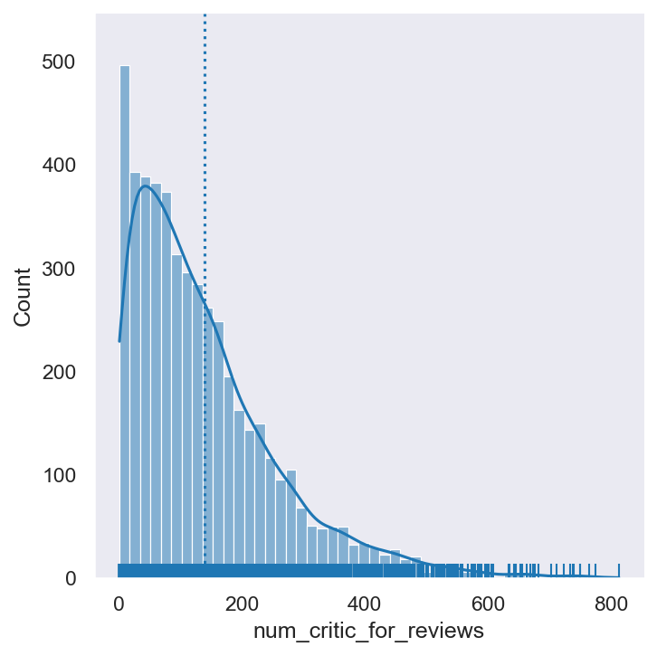
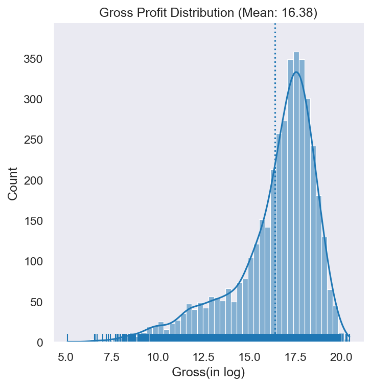
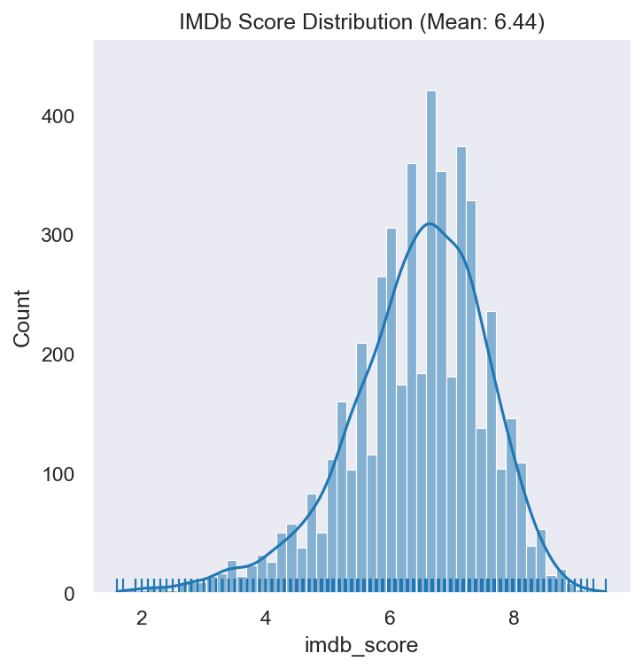
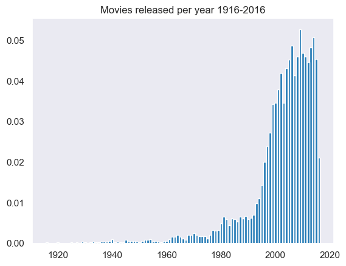
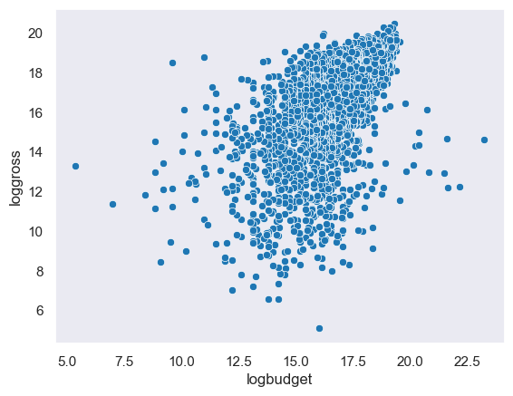
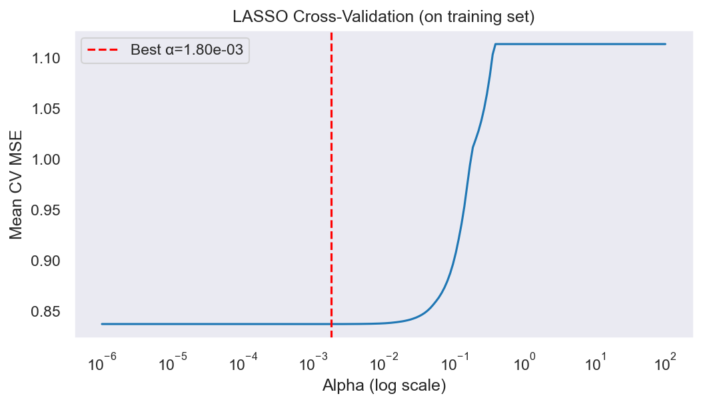
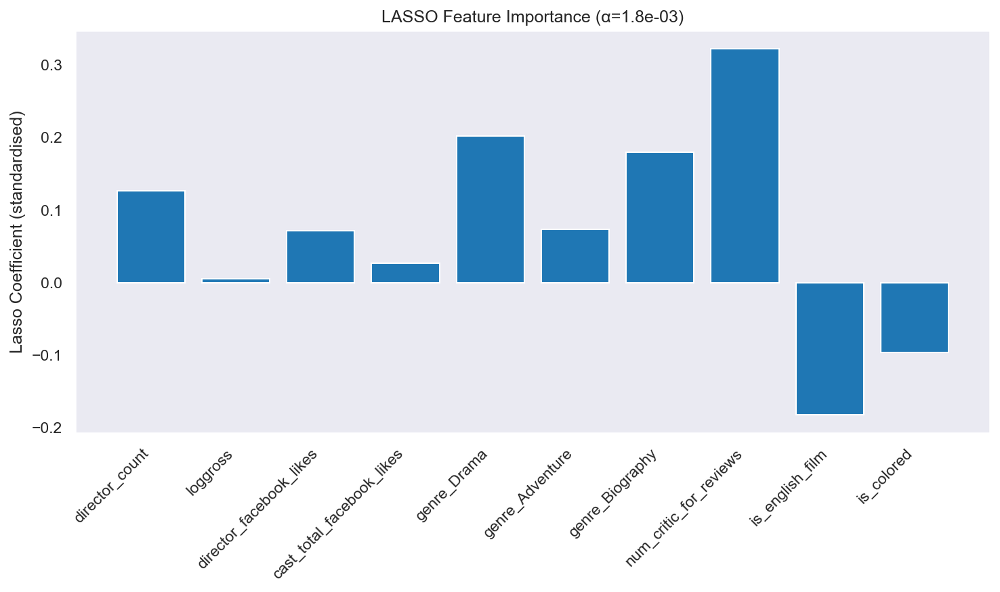
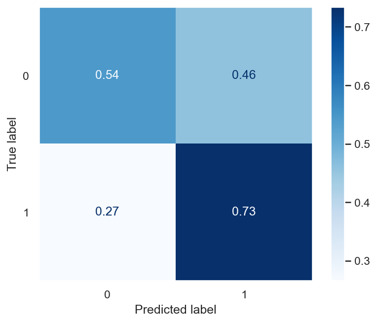
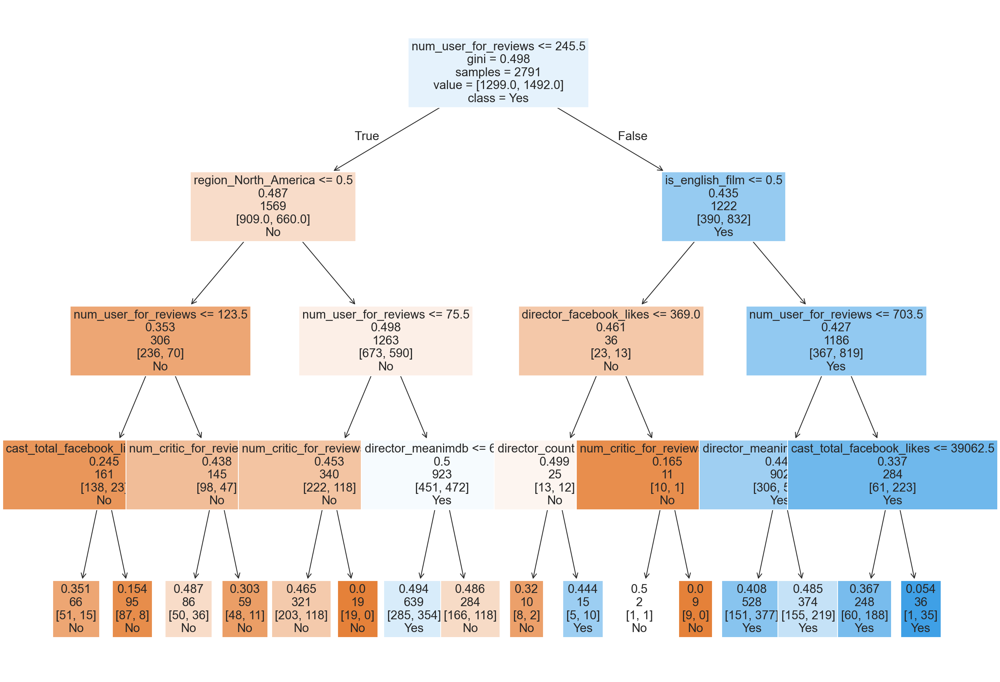
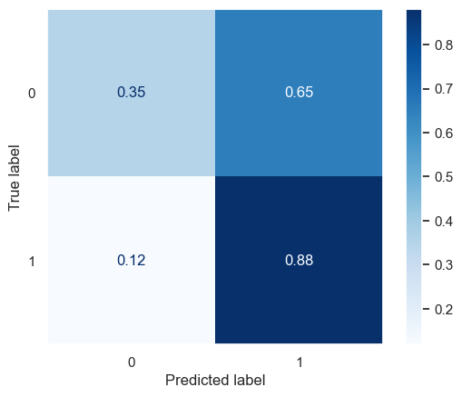

# IMDB 5000 Movie Data Analysis -- Prediction Models

Exploratory data analysis, data wrangling, and predictive modeling for IMDb movie scores and movie profitability using Python. This is a practice project focused on data wrangling and methodological implementation.

## Dataset

**Source:** [Kaggle IMDB 5000 Movie Dataset](https://www.kaggle.com/datasets/carolzhangdc/imdb-5000-movie-dataset/data)

- 5,043 movie entries (4,998 after deduplication), 28 columns
- Covers movies from 1916 to 2016 across 65+ countries
- Key columns: `imdb_score`, `gross`, `budget`, `director_name`, `genres`, `num_critic_for_reviews`, `content_rating`, `title_year`

## Methodology

### 1. Exploratory Data Analysis

Distribution analysis of key variables and relationship mapping between budget and gross profit.

| | |
|---|---|
|  |  |
|  |  |

### 2. Data Cleaning and Feature Engineering

After dropping duplicates and missing values (5,043 -> 3,722 complete cases), engineered features include:

- **Log transforms:** `logbudget`, `loggross`
- **Binary encodings:** `is_colored`, `is_english_film`, `profited` (gross >= budget)
- **Categorical recoding:** `main_genre` (primary genre extracted from multi-genre field), `region` (North America, UK, Europe, East Asia, Other)
- **Director-level aggregates:** `director_count` (number of movies per director), `director_meanimdb` (leave-one-out mean IMDb score per director — excludes the current movie's own score to avoid endogeneity; single-movie directors fall back to the global mean)

### 3. Regression -- Predicting IMDb Score

Used LASSO regression with train/test split (80/20) and 5-fold cross-validation on the training set to tune the regularization parameter (alpha). Features are standardized using training data only to prevent data leakage. 

| LASSO CV MSE | Feature Importance |
|---|---|
|  |  |

Candidate predictors: `director_count`, `loggross`, `director_facebook_likes`, `cast_total_facebook_likes`, `genre_Drama`, `genre_Adventure`, `genre_Biography`, `num_critic_for_reviews`, `is_english_film`, `is_colored`.

**Results:** Best alpha = 1.80e-03. All 10 features retained (non-zero coefficients).

| Metric | Train | Test |
|--------|-------|------|
| MSE | 0.8331 | 0.8605 |
| R² | 0.2515 | 0.2131 |

Top features by absolute coefficient (standardized): `num_critic_for_reviews` (0.32), `genre_Drama` (0.20), `is_english_film` (-0.18), `genre_Biography` (0.18), `director_count` (0.13), `is_colored` (-0.10).

### 4. Classification -- Predicting Break-Even

Binary classification predicting whether a movie's gross exceeds its budget.

#### Logistic Regression

- Uses leave-one-out `director_meanimdb` to avoid endogeneity
- 5-fold CV on training set for model validation
- 5-fold CV mean F1: 0.667
- Test accuracy: 65%
- Test F1 (class 1 — profited): 0.69

#### Decision Tree (max_depth=4)

- Test accuracy: 64%
- Test F1 (class 1 — profited): 0.71
- Higher precision for profitable movies (0.81) but lower recall (0.63)

The decision tree provides better performance at identifying profitable movies.

## Dependencies

- pandas
- numpy
- matplotlib
- seaborn
- scikit-learn
- statsmodels
